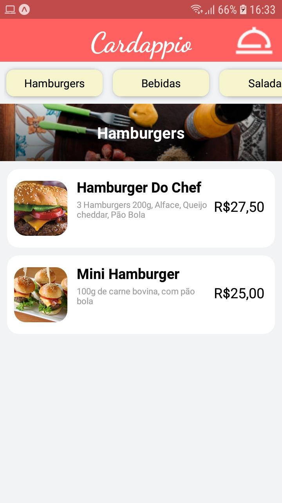

  

 
<h2 align="center">🚧 Em construção... 🚧</h2>
 
<h2>💻 Sobre</h2>

  
O Cardappio se trata de um sistema de gerenciamento de pratos e pedidos de restaurantes que tem como objetivo principal facilitar a comunicação entre consumidor e o estabelecimento, facilitando o controle de pratos no cardápio e melhorando a forma como os pedidos em restaurantes funcionam.

O sistema se divide em duas partes um aplicativo mobile e uma plataforma web, no aplicativo mobile os clientes tem acesso ao menu do estabelecimento e podem realizar seus pedidos, com base nas categorias e pratos disponíveis no cardápio.
Já na interface web, as funcionalidades são divididas em duas páginas, admin e cozinha. A página de amin é voltada para os administradores do sistema, onde há total controle sobre quais pratos estão no cardápio e todos os dados relacionados a eles. A página da cozinha é onde os pedidos serão recebidos e gerenciados pela equipe de acordo com o status do prato.

 
<h2>📱 Mobile</h2>
 

  
  
  
  

 

 
<h2>💻 Web</h2>
 

 
  
  
  

 
<h2>🛠 Tecnologias</h2>
 
<ul>
  <li><a>TypeScript</a></li>
  <li><a>Node</a></li>
  <li><a>ReactJS</a></li>
  <li><a>React Native</a></li>
  <li><a>MongoDB</a></li>
  <li><a>SocketIo</a></li>
  <li><a>Expo</a></li>
  <li><a>Axios</a></li>
</ul>

 

<h2>🤝 Contribuição</h2>

<table>
  <tr>
    <td align="center"><a href="https://github.com/DavysonMelo"> <b>Davyson Melo</b></a> <a href="https://github.com/DavysonMelo">🎮</a></td>
    <td align="center"><a href="https://github.com/danielbpc2"> <b>Daniel Carvalho</b></a> <a href="https://github.com/danielbpc2">🚀</a></td>
    <td align="center"><a href="https://github.com/NetoJL"> <b>José Neto</b></a> <a href="https://github.com/NetoJL">🏉</a></td>
    <td align="center"><a href="https://github.com/priolilucas1"> <b>Lucas Prioli</b></a> <a href="https://github.com/priolilucas1">🎮</a></td>
  </tr>
</table>
